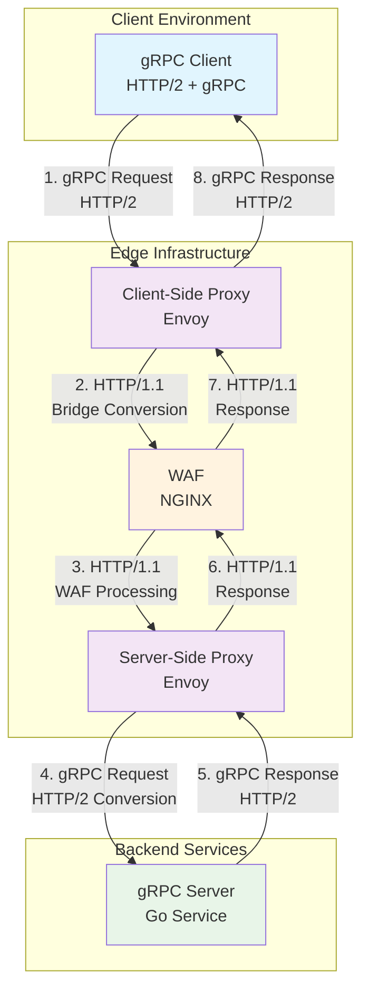

# gRPC through HTTP/1.1 WAF Proxy Architecture

This project demonstrates how to enable gRPC communication through an HTTP/1.1 Web Application Firewall (WAF) using Envoy proxy protocol bridges and Docker Compose.

## Problem Statement

Traditional gRPC services require HTTP/2 for proper operation, particularly for trailer handling that contains essential status information. However, many enterprise environments use HTTP/1.1-only WAFs that cannot natively handle gRPC traffic. This creates a challenge when trying to deploy gRPC services behind existing WAF infrastructure.

## Solution Overview

This architecture implements a **gRPC-to-HTTP/1.1 bridge** using Envoy proxies that:
- Converts incoming gRPC (HTTP/2) to HTTP/1.1 for WAF compatibility
- Routes traffic through an NGINX-based WAF
- Converts HTTP/1.1 back to gRPC (HTTP/2) for the backend service
- Provides TLS termination and certificate management

## Architecture Components

```
┌─────────────────┐    ┌───────────────────┐    ┌─────────┐    ┌───────────────────┐    ┌──────────────────┐
│   gRPC Client   │───▶│ Client-Side Proxy │───▶│   WAF   │───▶│ Server-Side Proxy │───▶│   gRPC Server    │
│                 │    │    (Envoy)        │    │ (NGINX) │    │     (Envoy)       │    │                  │
│ HTTP/2 + gRPC   │    │ gRPC → HTTP/1.1   │    │HTTP/1.1 │    │ HTTP/1.1 → gRPC   │    │  HTTP/2 + gRPC   │
└─────────────────┘    └───────────────────┘    └─────────┘    └───────────────────┘    └──────────────────┘
```

### Component Details

#### 1. gRPC Client (`user-grpc-client`)
- **Purpose**: Standard gRPC client application
- **Protocol**: HTTP/2 with gRPC
- **Features**: User management operations (CRUD), health checks
- **Configuration**: Connects to client-side proxy with TLS

#### 2. Client-Side Proxy (`client-side-proxy`)
- **Technology**: Envoy Proxy v1.33.4
- **Purpose**: Convert gRPC to HTTP/1.1 for WAF compatibility
- **Key Features**:
  - `envoy.filters.http.grpc_http1_bridge`: Converts gRPC to HTTP/1.1
  - TLS termination and re-encryption
  - gRPC statistics and monitoring
  - Timeout and retry configuration

#### 3. Web Application Firewall (`waf`)
- **Technology**: NGINX Alpine
- **Purpose**: Security filtering and traffic inspection
- **Features**:
  - HTTP/1.1 request/response handling
  - SSL/TLS proxy termination
  - Request logging and monitoring
  - Security header management

#### 4. Server-Side Proxy (`server-side-proxy`)
- **Technology**: Envoy Proxy v1.33.4
- **Purpose**: Convert HTTP/1.1 back to gRPC for backend service
- **Key Features**:
  - `envoy.filters.http.grpc_http1_reverse_bridge`: Converts HTTP/1.1 to gRPC
  - Connection pooling and load balancing
  - Health checking (TCP-based)
  - gRPC statistics collection

#### 5. gRPC Server (`user-grpc-server`)
- **Technology**: Go-based gRPC service
- **Purpose**: Backend business logic
- **Features**: User management API with protobuf definitions

## Flow Diagram



## Protocol Flow Details

### Request Flow
1. **Client → Client-Side Proxy**: gRPC request over HTTP/2 with TLS
2. **Client-Side Proxy**:
   - Terminates TLS
   - Applies `grpc_http1_bridge` filter
   - Converts gRPC to HTTP/1.1 POST request
   - Re-encrypts for WAF
3. **WAF**:
   - Inspects HTTP/1.1 traffic
   - Applies security policies
   - Forwards to server-side proxy
4. **Server-Side Proxy**:
   - Receives HTTP/1.1 request
   - Applies `grpc_http1_reverse_bridge` filter
   - Converts back to gRPC over HTTP/2
   - Forwards to gRPC server
5. **gRPC Server**: Processes business logic

### Response Flow
1. **gRPC Server**: Returns gRPC response over HTTP/2
2. **Server-Side Proxy**: Converts gRPC response to HTTP/1.1
3. **WAF**: Forwards HTTP/1.1 response
4. **Client-Side Proxy**: Converts HTTP/1.1 back to gRPC response
5. **Client**: Receives gRPC response

## Configuration Files

### Directory Structure
```
.
├── docker-compose.yml                 # Service orchestration
├── client-side-proxy/
│   └── envoy.yaml                    # Client-side Envoy configuration
├── server-side-proxy/
│   └── envoy.yaml                    # Server-side Envoy configuration
├── waf/
│   └── nginx.conf                    # WAF configuration
├── certs/                            # TLS certificates
│   ├── ca.crt, ca.key                # Certificate Authority
│   ├── client-proxy/                 # Client proxy certificates
│   ├── server-proxy/                 # Server proxy certificates
│   ├── waf/                          # WAF certificates
│   ├── grpc-service/                 # gRPC server certificates
│   └── grpc-client/                  # gRPC client certificates
└── generate-certs.sh                 # Certificate generation script
```

### Key Configuration Features

#### Client-Side Proxy (envoy.yaml)
```yaml
# HTTP/2 for downstream (client), HTTP/1.1 for upstream (WAF)
codec_type: HTTP2

http_filters:
- name: envoy.filters.http.grpc_http1_bridge
  # Converts gRPC to HTTP/1.1
- name: envoy.filters.http.grpc_stats
  # gRPC metrics collection
- name: envoy.filters.http.router
```

#### Server-Side Proxy (envoy.yaml)
```yaml
# HTTP/1.1 for downstream (WAF), HTTP/2 for upstream (gRPC server)
codec_type: HTTP1

http_filters:
- name: envoy.filters.http.grpc_http1_reverse_bridge
  # Converts HTTP/1.1 back to gRPC
- name: envoy.filters.http.grpc_stats
- name: envoy.filters.http.router
```

## Setup and Deployment

### Prerequisites
- Docker and Docker Compose
- Valid TLS certificates (generated via `generate-certs.sh`)

### Quick Start
```bash
# Generate certificates
./generate-certs.sh

# Start all services
docker compose up

# Test the setup
docker compose run --rm user-grpc-client
```

### Service URLs
- **gRPC Client → Client-Side Proxy**: `client-side-proxy:8443`
- **Client-Side Proxy → WAF**: `waf:443`
- **WAF → Server-Side Proxy**: `server-side-proxy:8443`
- **Server-Side Proxy → gRPC Server**: `user-grpc-server:50051`

## Testing and Validation

### Health Check Flow
```bash
# Direct connection to gRPC server (baseline)
docker compose run --rm -e SERVER_ADDRESS=user-grpc-server:50051 \
  -e TLS_SERVER_NAME=user-grpc-server user-grpc-client

# Through proxy chain
docker compose up user-grpc-client
```

### Log Monitoring
```bash
# Monitor proxy logs
docker compose logs -f client-side-proxy
docker compose logs -f server-side-proxy
docker compose logs -f waf

# Monitor gRPC server
docker compose logs -f user-grpc-server
```

## Known Limitations

### gRPC Trailer Handling
- **Issue**: gRPC trailers (containing status codes) may not be preserved through HTTP/1.1
- **Impact**: Some gRPC clients may report "server closed the stream without sending trailers"
- **Cause**: HTTP/1.1 protocol limitation - trailers are an HTTP/2 feature
- **Mitigation**: HTTP status codes are preserved; business logic remains functional

### Protocol Conversion Constraints
- Streaming gRPC calls may have limited functionality
- Some advanced gRPC features may not work through HTTP/1.1 bridge
- Performance overhead from double protocol conversion

## Monitoring and Observability

### Metrics Available
- **Envoy Admin Interface**: `http://localhost:9901/stats` (for each proxy)
- **gRPC Statistics**: Request counts, latencies, error rates
- **Connection Metrics**: Pool utilization, connection failures
- **WAF Logs**: Request/response logging via NGINX

### Key Metrics to Monitor
- `grpc.success` / `grpc.failure` counters
- `http.downstream_rq_2xx` / `http.downstream_rq_5xx`
- `cluster.upstream_rq_retry` and `cluster.upstream_rq_timeout`
- Connection pool statistics

## Security Considerations

### TLS Configuration
- End-to-end TLS encryption between all components
- Certificate validation at each hop
- SNI-based routing support

### WAF Integration
- HTTP/1.1 traffic inspection capabilities
- Standard web security policies applicable
- Request/response size limits and timeouts

## Troubleshooting

### Common Issues
1. **Certificate Errors**: Ensure all certificates are properly generated and mounted
2. **Connection Timeouts**: Check network connectivity between services
3. **Health Check Failures**: Verify gRPC server is responding on port 50051
4. **Trailer Errors**: Expected behavior due to HTTP/1.1 limitations

### Debug Commands
```bash
# Check service status
docker compose ps

# View service logs
docker compose logs <service-name>

# Test direct connectivity
docker compose exec client-side-proxy nc -zv waf 443
```

## Future Enhancements

1. **HTTP/2 WAF Support**: Upgrade to HTTP/2-capable WAF for native gRPC support
2. **Enhanced Monitoring**: Add Prometheus/Grafana for comprehensive metrics
3. **Circuit Breaker**: Implement circuit breaker patterns for resilience
4. **Rate Limiting**: Add request rate limiting at WAF level
5. **Service Mesh**: Consider Istio/Linkerd for more advanced traffic management

## Contributing

This project demonstrates enterprise-grade gRPC integration patterns. Contributions welcome for:
- Enhanced error handling
- Additional security features
- Performance optimizations
- Documentation improvements

## License

[Add appropriate license information]
