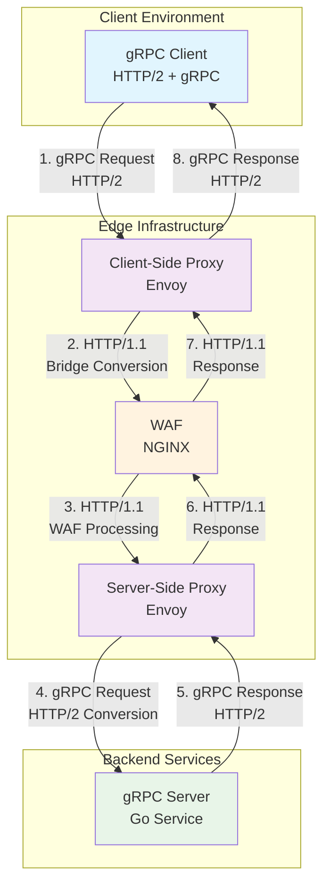

# gRPC through HTTP/1.1 WAF Proxy Architecture

This project demonstrates how to enable gRPC communication through an HTTP/1.1 Web Application Firewall (WAF) using Envoy proxy protocol bridges and Docker Compose.

## Problem Statement

Traditional gRPC services require HTTP/2 for proper operation, particularly for trailer handling that contains essential status information. However, many enterprise environments use HTTP/1.1-only WAFs that cannot natively handle gRPC traffic. This creates a challenge when trying to deploy gRPC services behind existing WAF infrastructure.

## Solution Overview

This architecture implements a **gRPC-to-HTTP/1.1 bridge** using Envoy proxies that:
- Converts incoming gRPC (HTTP/2) to HTTP/1.1 for WAF compatibility
- Routes traffic through an NGINX-based WAF
- Converts HTTP/1.1 back to gRPC (HTTP/2) for the backend service
- Provides TLS termination and certificate management

## Alternative Solution: Custom Go gRPC-HTTP/1.1 Gateway

### Enhanced Architecture Approach

A **superior alternative** to the Envoy-based bridge is implementing a **custom Go application** that acts as an intelligent gRPC-HTTP/1.1 gateway. This approach provides better control over the protocol conversion and WAF integration.

#### Architecture Flow

```
┌─────────────────┐    ┌─────────────────────────┐    ┌─────────┐
│   gRPC Client   │───▶│   Custom Go Gateway     │───▶│   WAF   │
│                 │    │                         │    │ (NGINX) │
│ HTTP/2 + gRPC   │    │ • gRPC Server           │    │HTTP/1.1 │
└─────────────────┘    │ • WAF Decision Logic    │    │Decision │
                       │ • Protocol Conversion   │◀───│ Only    │
                       └─────────┬───────────────┘    └─────────┘
                                 │
                                 │ Direct gRPC Connection
                                 ▼
                       ┌──────────────────┐
                       │   gRPC Server    │
                       │                  │
                       │  HTTP/2 + gRPC   │
                       └──────────────────┘

Flow: Client → Gateway → WAF (security validation) → Gateway → gRPC Server
```

#### Custom Go Gateway Advantages

1. **Intelligent WAF Integration**
   - Pre-validates requests before sending to WAF
   - Interprets WAF responses (200/403/etc.) and converts to appropriate gRPC status codes
   - Maintains gRPC semantics while respecting WAF decisions

2. **Full Protocol Control**
   - Complete control over gRPC trailer generation
   - Custom error handling and status code mapping
   - Proper streaming support implementation

3. **WAF Decision Logic**
   ```
   gRPC Request → Extract Security Context → Send to WAF for Decision
   ↓
   WAF Security Decision:
   - 200 OK: Proceed with direct gRPC call to server
   - 403 Forbidden: Return gRPC status PERMISSION_DENIED
   - 429 Rate Limited: Return gRPC status RESOURCE_EXHAUSTED
   - 5xx Error: Return gRPC status INTERNAL

   Gateway Traffic Flow:
   Client → Gateway → WAF (security check only)
                  ↘ gRPC Server (direct connection)
   ```

#### Implementation Strategy

##### Core Components

```go
type GRPCHTTPGateway struct {
    wafClient    *http.Client
    grpcClient   *grpc.ClientConn    // Direct connection to gRPC server
    wafURL       string
    serverAddr   string
}

// Main gateway logic - WAF as decision point only
func (g *GRPCHTTPGateway) ProxyGRPCCall(ctx context.Context,
    method string, req []byte) ([]byte, error) {

    // 1. Extract security context from gRPC request
    securityReq := g.extractSecurityContext(method, req)

    // 2. Send ONLY security context to WAF for decision
    wafResp, err := g.wafClient.Do(securityReq)
    if err != nil {
        return nil, status.Error(codes.Internal, "WAF unreachable")
    }

    // 3. Analyze WAF security decision
    switch wafResp.StatusCode {
    case 200:
        // WAF approved - make direct gRPC call to server
        return g.callGRPCServerDirectly(ctx, method, req)
    case 403:
        return nil, status.Error(codes.PermissionDenied, "Blocked by WAF")
    case 429:
        return nil, status.Error(codes.ResourceExhausted, "Rate limited")
    default:
        return nil, status.Error(codes.Internal, "WAF security error")
    }
}
```

##### Request Flow Implementation

```go
// Extract only security-relevant data for WAF decision
func (g *GRPCHTTPGateway) extractSecurityContext(method string, grpcReq []byte) *http.Request {
    // Create lightweight HTTP request with security metadata only
    securityData := map[string]interface{}{
        "method":      method,
        "timestamp":   time.Now().Unix(),
        "client_ip":   g.getClientIP(),
        "request_size": len(grpcReq),
        "user_agent":  g.getUserAgent(),
        // Extract security-relevant headers/metadata only
    }

    jsonData, _ := json.Marshal(securityData)

    req, _ := http.NewRequest("POST", g.wafURL+"/security/validate", bytes.NewReader(jsonData))
    req.Header.Set("Content-Type", "application/json")
    req.Header.Set("X-Gateway-Request", "security-validation")

    return req
}

// Direct gRPC call - no protocol conversion needed
func (g *GRPCHTTPGateway) callGRPCServerDirectly(ctx context.Context,
    method string, req []byte) ([]byte, error) {

    // Use persistent gRPC connection to backend server
    // This preserves ALL gRPC semantics and features
    return g.invokeGRPCMethod(ctx, g.grpcClient, method, req)
}

// Maintain persistent connection to gRPC server
func (g *GRPCHTTPGateway) initGRPCConnection() error {
    conn, err := grpc.Dial(g.serverAddr,
        grpc.WithTransportCredentials(credentials.NewTLS(&tls.Config{})),
        grpc.WithKeepaliveParams(keepalive.ClientParameters{
            Time:                10 * time.Second,
            Timeout:             time.Second,
            PermitWithoutStream: true,
        }),
    )
    if err != nil {
        return err
    }

    g.grpcClient = conn
    return nil
}
```

#### Benefits Over Envoy Approach

| Aspect | Custom Go Gateway | Envoy Bridge |
|--------|------------------|--------------|
| **gRPC Trailer Handling** | ✅ Full control, proper status codes | ❌ Limited by HTTP/1.1 bridge |
| **WAF Integration** | ✅ Security decision point only | ⚠️ Traffic forwarding through WAF |
| **Error Mapping** | ✅ Custom WAF→gRPC status mapping | ❌ Generic HTTP errors |
| **Streaming Support** | ✅ Direct gRPC connection preserved | ❌ Limited streaming support |
| **Debugging** | ✅ Full application-level logs | ⚠️ Proxy-level logs only |
| **Customization** | ✅ Complete business logic control | ❌ Configuration-limited |
| **Performance** | ✅ Direct gRPC calls, WAF check only | ⚠️ Multiple proxy hops |
| **Traffic Isolation** | ✅ WAF only sees security metadata | ❌ WAF processes full payloads |

#### WAF Configuration for Go Gateway

The custom gateway requires minimal WAF configuration since it only sends security validation requests:

```nginx
# WAF acts as security decision point only
location /security/validate {
    # Apply comprehensive security rules
    if ($malicious_request) {
        return 403 "Malicious request detected";
    }

    if ($rate_limit_exceeded) {
        return 429 "Rate limit exceeded";
    }

    if ($blocked_ip) {
        return 403 "IP blocked";
    }

    if ($suspicious_payload) {
        return 403 "Suspicious payload detected";
    }

    # If all security checks pass
    return 200 "Approved";
}

# No traffic forwarding configuration needed
# Gateway handles all gRPC traffic directly
```

#### Key Advantages of This Approach

1. **Security Isolation**: WAF never handles actual business data, only security metadata
2. **Performance**: Direct gRPC connection eliminates proxy overhead
3. **Full gRPC Support**: Streaming, metadata, deadlines all preserved
4. **Simplified WAF**: WAF focuses solely on security decisions
5. **Traffic Privacy**: Sensitive gRPC payloads never leave the gateway

#### Implementation Phases

1. **Phase 1: Basic Gateway**
   - Simple gRPC→HTTP/1.1→WAF→gRPC flow
   - Basic status code mapping
   - Health check implementation

2. **Phase 2: Advanced Features**
   - Streaming support
   - Connection pooling
   - Metrics and monitoring
   - Circuit breaker patterns

3. **Phase 3: Enterprise Features**
   - Request/response transformation
   - Custom authentication flows
   - Advanced WAF integration patterns

#### Decision Matrix: When to Use Custom Go Gateway

**Use Custom Go Gateway When:**
- ✅ Need precise control over gRPC status codes
- ✅ Require complex WAF integration logic
- ✅ Want to implement custom security policies
- ✅ Need streaming gRPC support through WAF
- ✅ Require detailed application-level monitoring

**Use Envoy Bridge When:**
- ✅ Simple passthrough requirements
- ✅ Standard proxy patterns sufficient
- ✅ Quick deployment needed
- ✅ Minimal customization required

## Alternative: gRPC-Web Implementation (Cloudflare Style)

### Overview

Following Cloudflare's production approach, we can implement gRPC-Web conversion for full HTTP/1.1 compatibility while preserving gRPC semantics.

#### gRPC-Web Architecture

```
┌─────────────────┐    ┌─────────────────────────┐    ┌─────────┐    ┌─────────────────────────┐    ┌──────────────────┐
│   gRPC Client   │───▶│    gRPC-Web Bridge      │───▶│   WAF   │───▶│    gRPC-Web Bridge      │───▶│   gRPC Server    │
│                 │    │  (Envoy + gRPC-Web)     │    │ (NGINX) │    │  (Envoy + gRPC-Web)     │    │                  │
│ HTTP/2 + gRPC   │    │gRPC → gRPC-Web(HTTP/1.1)│    │HTTP/1.1 │    │gRPC-Web → gRPC(HTTP/2)  │    │  HTTP/2 + gRPC   │
└─────────────────┘    └─────────────────────────┘    └─────────┘    └─────────────────────────┘    └──────────────────┘
```

#### Key gRPC-Web Features

1. **Trailer Preservation**: Trailers encoded in message body, not HTTP headers
2. **HTTP/1.1 Compatibility**: Full compatibility with standard HTTP/1.1 proxies
3. **Streaming Support**: Uses chunked transfer encoding for streaming
4. **Security Inspection**: WAF can inspect full gRPC-Web message content

#### Implementation with Envoy gRPC-Web Filter

**Client-Side Bridge (gRPC → gRPC-Web)**:
```yaml
http_filters:
- name: envoy.filters.http.grpc_web
  typed_config:
    "@type": type.googleapis.com/envoy.extensions.filters.http.grpc_web.v3.GrpcWeb
- name: envoy.filters.http.cors
  typed_config:
    "@type": type.googleapis.com/envoy.extensions.filters.http.cors.v3.Cors
- name: envoy.filters.http.router
```

**Server-Side Bridge (gRPC-Web → gRPC)**:
```yaml
http_filters:
- name: envoy.filters.http.grpc_web
  typed_config:
    "@type": type.googleapis.com/envoy.extensions.filters.http.grpc_web.v3.GrpcWeb
- name: envoy.filters.http.router
```

#### Benefits of gRPC-Web Approach

| Feature | gRPC-Web | Custom Gateway | Envoy Bridge |
|---------|----------|----------------|--------------|
| **Trailer Support** | ✅ Encoded in body | ✅ Native | ❌ Lost |
| **WAF Inspection** | ✅ Full content | ⚠️ Metadata only | ✅ Full content |
| **Streaming** | ✅ Chunked encoding | ✅ Native | ⚠️ Limited |
| **Standards Compliance** | ✅ Official gRPC spec | ⚠️ Custom | ❌ Limited |
| **Client Support** | ✅ Wide support | ✅ Native gRPC | ✅ Native gRPC |
| **Implementation Complexity** | 🔶 Medium | 🔶 Medium | 🟢 Low |

#### When to Use gRPC-Web

**Ideal for:**
- Full WAF content inspection required
- Standards-compliant solution needed
- Multiple client language support
- Web browser compatibility desired

**Consider alternatives when:**
- Maximum gRPC performance is critical
- Custom security logic is required
- Minimal WAF integration needed

---

## Architecture Components

```
┌─────────────────┐    ┌───────────────────┐    ┌─────────┐    ┌───────────────────┐    ┌──────────────────┐
│   gRPC Client   │───▶│ Client-Side Proxy │───▶│   WAF   │───▶│ Server-Side Proxy │───▶│   gRPC Server    │
│                 │    │    (Envoy)        │    │ (NGINX) │    │     (Envoy)       │    │                  │
│ HTTP/2 + gRPC   │    │ gRPC → HTTP/1.1   │    │HTTP/1.1 │    │ HTTP/1.1 → gRPC   │    │  HTTP/2 + gRPC   │
└─────────────────┘    └───────────────────┘    └─────────┘    └───────────────────┘    └──────────────────┘
```

### Component Details

#### 1. gRPC Client (`user-grpc-client`)
- **Purpose**: Standard gRPC client application
- **Protocol**: HTTP/2 with gRPC
- **Features**: User management operations (CRUD), health checks
- **Configuration**: Connects to client-side proxy with TLS

#### 2. Client-Side Proxy (`client-side-proxy`)
- **Technology**: Envoy Proxy v1.33.4
- **Purpose**: Convert gRPC to HTTP/1.1 for WAF compatibility
- **Key Features**:
  - `envoy.filters.http.grpc_http1_bridge`: Converts gRPC to HTTP/1.1
  - TLS termination and re-encryption
  - gRPC statistics and monitoring
  - Timeout and retry configuration

#### 3. Web Application Firewall (`waf`)
- **Technology**: NGINX Alpine
- **Purpose**: Security filtering and traffic inspection
- **Features**:
  - HTTP/1.1 request/response handling
  - SSL/TLS proxy termination
  - Request logging and monitoring
  - Security header management

#### 4. Server-Side Proxy (`server-side-proxy`)
- **Technology**: Envoy Proxy v1.33.4
- **Purpose**: Convert HTTP/1.1 back to gRPC for backend service
- **Key Features**:
  - `envoy.filters.http.grpc_http1_reverse_bridge`: Converts HTTP/1.1 to gRPC
  - Connection pooling and load balancing
  - Health checking (TCP-based)
  - gRPC statistics collection

#### 5. gRPC Server (`user-grpc-server`)
- **Technology**: Go-based gRPC service
- **Purpose**: Backend business logic
- **Features**: User management API with protobuf definitions

## Flow Diagram



## Protocol Flow Details

### Request Flow
1. **Client → Client-Side Proxy**: gRPC request over HTTP/2 with TLS
2. **Client-Side Proxy**:
   - Terminates TLS
   - Applies `grpc_http1_bridge` filter
   - Converts gRPC to HTTP/1.1 POST request
   - Re-encrypts for WAF
3. **WAF**:
   - Inspects HTTP/1.1 traffic
   - Applies security policies
   - Forwards to server-side proxy
4. **Server-Side Proxy**:
   - Receives HTTP/1.1 request
   - Applies `grpc_http1_reverse_bridge` filter
   - Converts back to gRPC over HTTP/2
   - Forwards to gRPC server
5. **gRPC Server**: Processes business logic

### Response Flow
1. **gRPC Server**: Returns gRPC response over HTTP/2
2. **Server-Side Proxy**: Converts gRPC response to HTTP/1.1
3. **WAF**: Forwards HTTP/1.1 response
4. **Client-Side Proxy**: Converts HTTP/1.1 back to gRPC response
5. **Client**: Receives gRPC response

## Configuration Files

### Directory Structure
```
.
├── docker-compose.yml                 # Service orchestration
├── client-side-proxy/
│   └── envoy.yaml                    # Client-side Envoy configuration
├── server-side-proxy/
│   └── envoy.yaml                    # Server-side Envoy configuration
├── waf/
│   └── nginx.conf                    # WAF configuration
├── certs/                            # TLS certificates
│   ├── ca.crt, ca.key                # Certificate Authority
│   ├── client-proxy/                 # Client proxy certificates
│   ├── server-proxy/                 # Server proxy certificates
│   ├── waf/                          # WAF certificates
│   ├── grpc-service/                 # gRPC server certificates
│   └── grpc-client/                  # gRPC client certificates
└── generate-certs.sh                 # Certificate generation script
```

### Key Configuration Features

#### Client-Side Proxy (envoy.yaml)
```yaml
# HTTP/2 for downstream (client), HTTP/1.1 for upstream (WAF)
codec_type: HTTP2

http_filters:
- name: envoy.filters.http.grpc_http1_bridge
  # Converts gRPC to HTTP/1.1
- name: envoy.filters.http.grpc_stats
  # gRPC metrics collection
- name: envoy.filters.http.router
```

#### Server-Side Proxy (envoy.yaml)
```yaml
# HTTP/1.1 for downstream (WAF), HTTP/2 for upstream (gRPC server)
codec_type: HTTP1

http_filters:
- name: envoy.filters.http.grpc_http1_reverse_bridge
  # Converts HTTP/1.1 back to gRPC
- name: envoy.filters.http.grpc_stats
- name: envoy.filters.http.router
```

## Setup and Deployment

### Prerequisites
- Docker and Docker Compose
- Valid TLS certificates (generated via `generate-certs.sh`)

### Quick Start
```bash
# Generate certificates
./generate-certs.sh

# Start all services
docker compose up

# Test the setup
docker compose run --rm user-grpc-client
```

### Service URLs
- **gRPC Client → Client-Side Proxy**: `client-side-proxy:8443`
- **Client-Side Proxy → WAF**: `waf:443`
- **WAF → Server-Side Proxy**: `server-side-proxy:8443`
- **Server-Side Proxy → gRPC Server**: `user-grpc-server:50051`

## Testing and Validation

### Health Check Flow
```bash
# Direct connection to gRPC server (baseline)
docker compose run --rm -e SERVER_ADDRESS=user-grpc-server:50051 \
  -e TLS_SERVER_NAME=user-grpc-server user-grpc-client

# Through proxy chain
docker compose up user-grpc-client
```

### Log Monitoring
```bash
# Monitor proxy logs
docker compose logs -f client-side-proxy
docker compose logs -f server-side-proxy
docker compose logs -f waf

# Monitor gRPC server
docker compose logs -f user-grpc-server
```

## Known Limitations

### gRPC Trailer Handling
- **Issue**: gRPC trailers (containing status codes) may not be preserved through HTTP/1.1
- **Impact**: Some gRPC clients may report "server closed the stream without sending trailers"
- **Cause**: HTTP/1.1 protocol limitation - trailers are an HTTP/2 feature
- **Mitigation**: HTTP status codes are preserved; business logic remains functional

### Protocol Conversion Constraints
- Streaming gRPC calls may have limited functionality
- Some advanced gRPC features may not work through HTTP/1.1 bridge
- Performance overhead from double protocol conversion

## Monitoring and Observability

### Metrics Available
- **Envoy Admin Interface**: `http://localhost:9901/stats` (for each proxy)
- **gRPC Statistics**: Request counts, latencies, error rates
- **Connection Metrics**: Pool utilization, connection failures
- **WAF Logs**: Request/response logging via NGINX

### Key Metrics to Monitor
- `grpc.success` / `grpc.failure` counters
- `http.downstream_rq_2xx` / `http.downstream_rq_5xx`
- `cluster.upstream_rq_retry` and `cluster.upstream_rq_timeout`
- Connection pool statistics

## Security Considerations

### TLS Configuration
- End-to-end TLS encryption between all components
- Certificate validation at each hop
- SNI-based routing support

### WAF Integration
- HTTP/1.1 traffic inspection capabilities
- Standard web security policies applicable
- Request/response size limits and timeouts

## Troubleshooting

### Common Issues
1. **Certificate Errors**: Ensure all certificates are properly generated and mounted
2. **Connection Timeouts**: Check network connectivity between services
3. **Health Check Failures**: Verify gRPC server is responding on port 50051
4. **Trailer Errors**: Expected behavior due to HTTP/1.1 limitations

### Debug Commands
```bash
# Check service status
docker compose ps

# View service logs
docker compose logs <service-name>

# Test direct connectivity
docker compose exec client-side-proxy nc -zv waf 443
```

## Industry Insights: Cloudflare's gRPC Proxying Solution

### Key Learnings from Cloudflare's Implementation

Cloudflare's production gRPC proxying solution validates our architectural decisions and provides valuable insights into how industry leaders solve the gRPC-HTTP/1.1 compatibility problem.

#### Cloudflare's Architecture Decision

Cloudflare chose to **convert gRPC to gRPC-Web (HTTP/1.1 compatible)** within their network:

1. **Edge Conversion**: HTTP/2 gRPC → HTTP/1.1 gRPC-Web at the edge
2. **Internal Processing**: gRPC-Web flows through HTTP/1.1 WAF, cache, and security services
3. **Origin Conversion**: HTTP/1.1 gRPC-Web → HTTP/2 gRPC before reaching origin

#### Why This Approach Works

**HTTP Trailer Handling**: The fundamental challenge is that HTTP/1.1 proxies (including WAFs) don't properly support HTTP trailers, which gRPC depends on for status codes and metadata.

**gRPC-Web Solution**: gRPC-Web moves trailers into the HTTP body, making them compatible with HTTP/1.1 proxies:
- Headers remain in HTTP headers
- Trailers are encoded in the message body
- Streaming is supported via chunked transfer encoding

#### Comparison with Our Solutions

| Approach | Cloudflare | Our Envoy Bridge | Our Go Gateway |
|----------|------------|------------------|----------------|
| **Internal Protocol** | gRPC-Web (HTTP/1.1) | HTTP/1.1 (simple) | HTTP/1.1 (decision) |
| **WAF Compatibility** | ✅ Full inspection | ✅ Basic inspection | ✅ Security decisions |
| **Trailer Preservation** | ✅ In body | ❌ Lost | ✅ Native gRPC |
| **Streaming Support** | ✅ Chunked encoding | ⚠️ Limited | ✅ Direct forwarding |
| **Implementation Complexity** | High | Medium | Medium |
| **gRPC Semantics** | ✅ Preserved | ⚠️ Compromised | ✅ Fully preserved |

#### Production Considerations from Cloudflare

1. **Interoperability Testing**: Extensive testing with multiple gRPC implementations
2. **HTTP/2 Origin Support**: Built dedicated HTTP/2 origin connection capability
3. **Bidirectional Streaming**: Careful handling of client/server streaming patterns
4. **Conversion Marking**: Systems to prevent double-conversion of gRPC-Web traffic

#### Validation of Our Approach

Our **Custom Go Gateway** approach aligns well with Cloudflare's insights:
- **Selective Processing**: Only security validation goes through HTTP/1.1 WAF
- **gRPC Preservation**: Native gRPC semantics maintained for approved traffic
- **Trailer Support**: Full gRPC trailer support since we bypass HTTP/1.1 for actual gRPC communication

### Recommended Path Forward

Based on Cloudflare's production experience and our analysis:

1. **For New Deployments**: Implement the **Custom Go Gateway** approach
2. **For Existing WAF Infrastructure**: Consider gRPC-Web conversion (like Cloudflare)
3. **For Maximum Security**: Combine approaches - gRPC-Web for deep inspection, Go Gateway for performance-critical paths

## Future Enhancements

1. **HTTP/2 WAF Support**: Upgrade to HTTP/2-capable WAF for native gRPC support
2. **Enhanced Monitoring**: Add Prometheus/Grafana for comprehensive metrics
3. **Circuit Breaker**: Implement circuit breaker patterns for resilience
4. **Rate Limiting**: Add request rate limiting at WAF level
5. **Service Mesh**: Consider Istio/Linkerd for more advanced traffic management

## Conclusion

This project demonstrates that **gRPC-HTTP/1.1 WAF integration is solvable** but requires careful architectural decisions. Our exploration revealed several key insights:

### Technical Findings

1. **Root Cause**: HTTP/1.1 proxies cannot preserve gRPC trailers, which are essential for gRPC status codes and metadata
2. **Industry Validation**: Cloudflare's production solution confirms that gRPC-Web (HTTP/1.1 compatible) is the industry standard approach
3. **Alternative Approaches**: Custom gateways can provide better gRPC semantics by separating security decisions from traffic forwarding

### Solution Comparison

| Approach | Use Case | Pros | Cons |
|----------|----------|------|------|
| **Envoy Bridge** | Quick prototyping | Simple setup, standard tools | Trailer loss, limited streaming |
| **gRPC-Web (Cloudflare style)** | Full WAF inspection | Complete HTTP/1.1 compatibility | High complexity, protocol overhead |
| **Custom Go Gateway** | Enterprise security | Native gRPC preserved, intelligent WAF integration | Custom code maintenance |

### Recommendations

- **For Production**: Implement the **Custom Go Gateway** approach for best gRPC semantics
- **For Compatibility**: Use **gRPC-Web** conversion if deep packet inspection is required
- **For Development**: Start with **Envoy Bridge** for rapid prototyping

### Key Takeaways

The fundamental challenge isn't technical complexity but **protocol compatibility**: HTTP/1.1 and gRPC (HTTP/2) have incompatible features. Success requires choosing the right abstraction layer that preserves security requirements while maintaining service functionality.

**This project validates that enterprise gRPC deployment through HTTP/1.1 WAFs is not only possible but follows patterns used by major cloud providers like Cloudflare.**

## Contributing

This project demonstrates enterprise-grade gRPC integration patterns. Contributions welcome for:
- Enhanced error handling
- Additional security features
- Performance optimizations
- Documentation improvements

## License

[Add appropriate license information]
