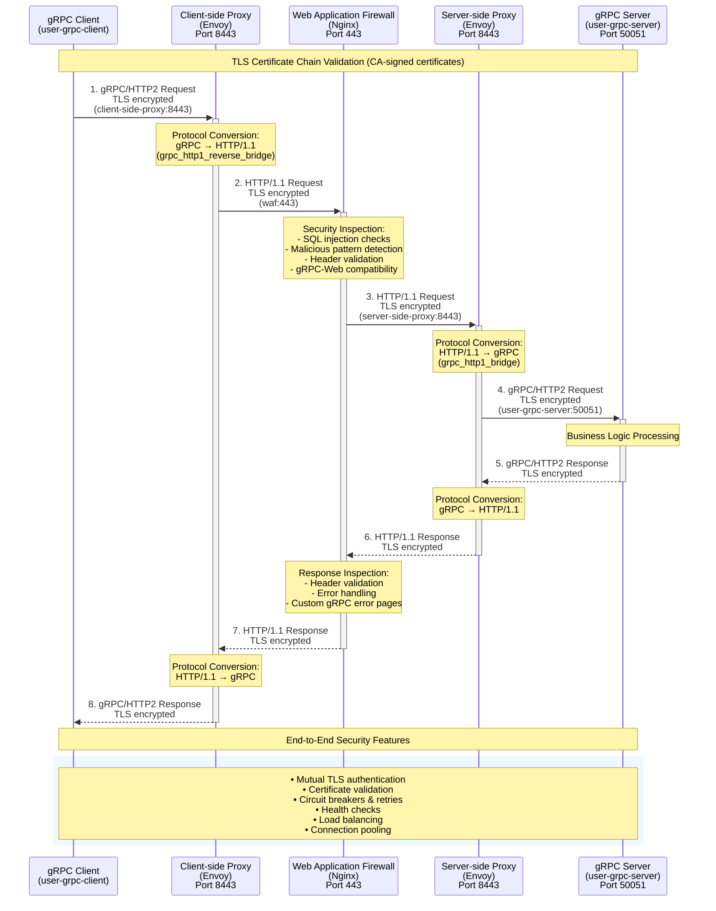

# gRPC Bridge Architecture Flow

This document describes the complete flow from gRPC client to server through the gRPC bridge architecture.

## Architecture Overview

The gRPC bridge consists of multiple components that handle protocol conversion, security, and routing:

1. **gRPC Client** - Initiates gRPC calls with TLS
2. **Client-side Proxy (Envoy)** - Converts gRPC to HTTP/1.1 for WAF compatibility
3. **WAF (Nginx)** - Web Application Firewall for security inspection
4. **Server-side Proxy (Envoy)** - Converts HTTP/1.1 back to gRPC
5. **gRPC Server** - Handles the actual gRPC service calls

## Sequence Diagram

## Protocol Conversions

### Client-side Proxy (Envoy)
- **Input**: gRPC/HTTP2 from client
- **Output**: HTTP/1.1 to WAF
- **Filter**: `envoy.filters.http.grpc_http1_reverse_bridge`
- **Purpose**: Convert gRPC to HTTP/1.1 for WAF compatibility

### Server-side Proxy (Envoy)
- **Input**: HTTP/1.1 from WAF
- **Output**: gRPC/HTTP2 to server
- **Filter**: `envoy.filters.http.grpc_http1_bridge`
- **Purpose**: Convert HTTP/1.1 back to native gRPC

## Security Features

### TLS Configuration
- All components use mutual TLS with CA-signed certificates
- Certificate distribution handled by `generate-certs.sh`
- SNI validation for proper certificate matching

### WAF Protection
- SQL injection pattern detection
- Malicious request filtering
- gRPC-specific header preservation
- Custom error handling for gRPC responses

### Circuit Breakers & Resilience
- Connection limits and timeouts
- Retry policies with exponential backoff
- Health checks for service availability
- Outlier detection for automatic failover

## Performance Optimizations

### HTTP/2 Settings
- Optimized stream and connection window sizes
- Enhanced concurrent stream limits
- Connection pooling and keepalive

### Buffer Management
- Request/response buffering disabled for streaming
- Optimized buffer sizes for high throughput
- Connection-level optimizations

## Error Handling

### Retry Policies
- Automatic retries on 5xx, timeouts, and connection failures
- Exponential backoff with jitter
- Host selection retry for failover

### Custom Error Pages
- gRPC-specific error responses from WAF
- Proper gRPC status codes and messages
- Graceful degradation on service unavailability
